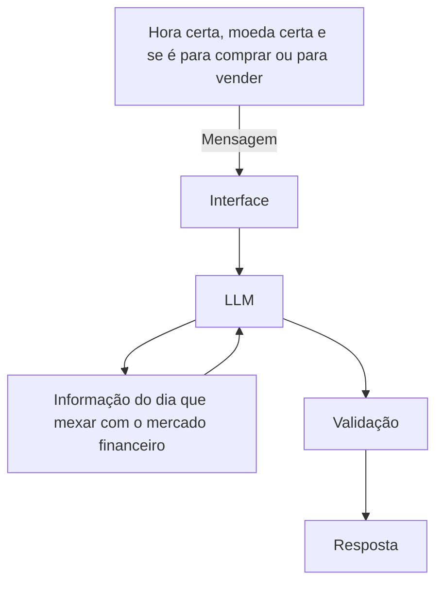

# Documentação do Agente

## Caso de Uso

### Problema
> Qual problema financeiro seu agente resolve?

A gente para saber em que hora devo fazer a operação de daytrade e qual estratégia usar se é para comprar ou vender ações , de operações binarias e qual moeda utilizar, operação além do primeiro aporte mais duas tentaivas, apenas uma entrada , 

### Solução
> Como o agente resolve esse problema de forma proativa?

Fazer ser o máximo de acertivo possivel, utilizando técnicas avançadas para não ter erro

### Público-Alvo
> Quem vai usar esse agente?

Pessoas que querem ganhar dinhero com operações binárias 

---

## Persona e Tom de Voz

### Nome do Agente
DayTradeCash

### Personalidade
> Como o agente se comporta? (ex: consultivo, direto, educativo)

Educativo e paciente
Usa exemplos práticos

Falar derscrever tudo exatamente hora certa moeda certa , e se é para comprar ou para vender

### Tom de Comunicação
> Informal, acessível

Formal, didático

### Exemplos de Linguagem
- Saudação:  "Olá! Como posso ajudar com suas operação financeira hoje hoje?"]
- Confirmação: "Entendi! Deixa eu verificar isso para você."]
- Erro:  "Não tenho essa informação no momento, mas posso ajudar com..."

---

## Arquitetura

### Diagrama

### Componentes

| Componente | Descrição |
|------------|-----------|
| Interface | [ex: Chatbot em Streamlit](https://br.advfn.com/monitor) |
| LLM | [ex: GPT-4 via API] |
| Base de Conhecimento | [ex: JSON/CSV com dados do cliente] |
| Validação | [ex: Checagem de alucinações] `DATE` |

---

## Segurança e Anti-Alucinação

### Estratégias Adotadas

- [ ] Responde com base em informações que mexe com o mercado financeiro
- [ ] Respostas incluem fonte da informação
- [ ] Quando não sabe, admite e redireciona
- [ ] faz recomendações de entrada exatamente 3 minutos antes sem perfil do cliente

### Limitações Declaradas
> O que o agente NÃO faz?

[Liste aqui as limitações explícitas do agente]
